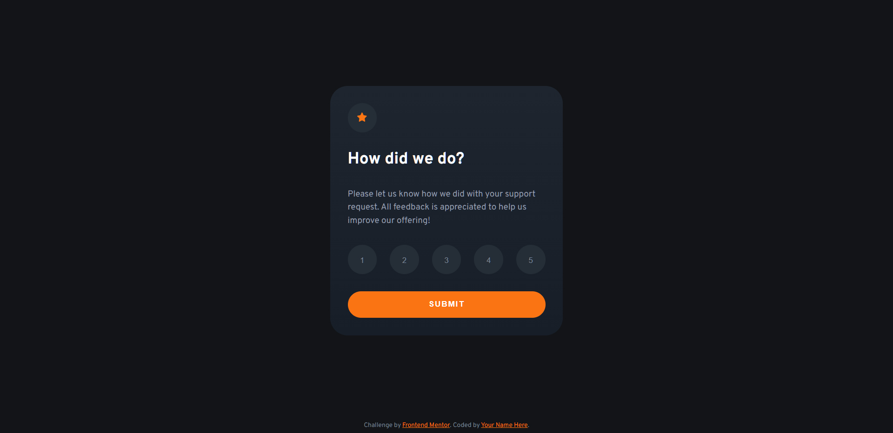

# Frontend Mentor - Interactive rating component solution

This is a solution to the [Interactive rating component challenge on Frontend Mentor](https://www.frontendmentor.io/challenges/interactive-rating-component-koxpeBUmI). Frontend Mentor challenges help you improve your coding skills by building realistic projects.

## Table of contents

- [Overview](#overview)
  - [The challenge](#the-challenge)
  - [Screenshot](#screenshot)
  - [Links](#links)
- [My process](#my-process)
  - [Built with](#built-with)
  - [What I learned](#what-i-learned)
  - [Continued development](#continued-development)
  - [Useful resources](#useful-resources)
- [Author](#author)
- [Acknowledgments](#acknowledgments)

**Note: Delete this note and update the table of contents based on what sections you keep.**

## Overview

This is a solution for a Frontend Mentor Challeng Hub.

### The challenge

### Screenshot

### Links

- Solution URL: [Add solution URL here](https://github.com/felbart/fm-int-rating-component.git)
- Live Site URL: [Add live site URL here](https://fm-interactive-rating-003.netlify.app/)

## My process

### Built with

- Semantic HTML5 markup
- CSS custom properties
- Flexbox
- JavaScript

### Useful resources

## Author

- Website - [Felipe Leite](https://www.felipeleite.me)
- Linkedin - [Felipe Leite](https://linkedin.com/in/felbart)
- Frontend Mentor - [@felbart](https://www.frontendmentor.io/profile/felbart)
- Twitter - [@felbart](https://www.twitter.com/felbart)
